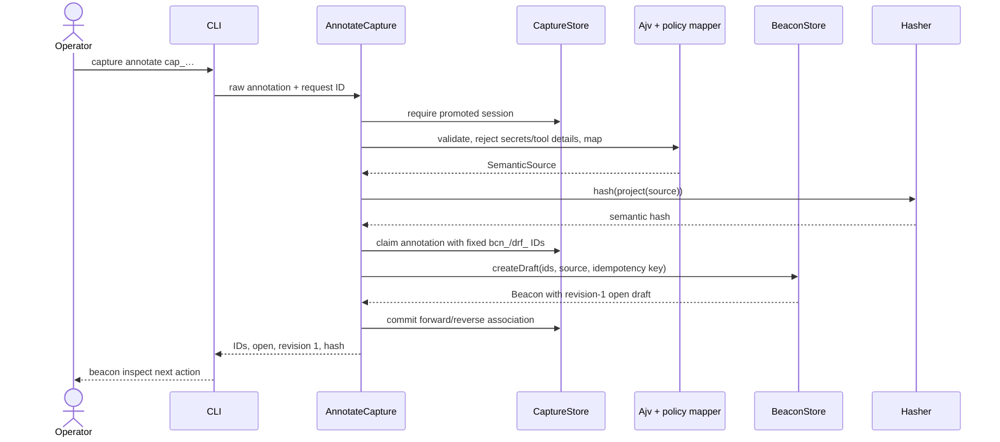

# Guided Beacon Capture Technical Design

## Decision summary

This change adds one vertical workflow and no later lifecycle:

```text
pharos init
  → pharos capture record
  → pharos capture annotate <capture-id>
  → pharos beacon inspect <beacon-id>
```

The application layer coordinates four use cases behind domain-owned ports. Project context and capture data are stored beside, but not by, `FsBeaconStore`. A capture is written into a restrictive staging area, scanned against transiently resolved predeclared secret values, and promoted only when safe. Annotation is the only Beacon-creation boundary: a validated, tool-neutral contract is mapped to the existing `SemanticSource`, hashed through the unchanged `project()` plus `JcsSha256Hasher` path, and passed once to `BeaconStore.createDraft`.

No command in this change approves, hands off, generates, runs, collects evidence, verifies, exposes MCP, manages the target application, or writes to an external target repository.

## Authority and decision status

Repository authority is applied in this order:

1. `docs/domain-requirements-v1.md`
2. `docs/lifecycle-and-schema-specification-v1.md`
3. the four delta specs in this change
4. `proposal.md` and `preproposal.md`
5. `docs/technical-design-v1.md` for compatible technical choices only; it is explicitly a draft
6. historical `product-requirements-v1.md` and `PHAROS.md` only where they do not conflict

### Confirmed product decisions

| Decision | Consequence |
|---|---|
| The exact workflow is `init → capture record → capture annotate → beacon inspect`. | The CLI adds only those product commands. |
| Only a terminal `promoted` capture is annotatable. | `failed`, `interrupted`, `rejected`, and in-progress sessions never reach `BeaconStore`. |
| Annotation creates exactly one revision-1 `open` Beacon and returns its ID. | Recording and inspection are read/supporting operations with respect to Beacon authority. |
| Raw capture is supporting and non-authoritative. | It is excluded from `SemanticSource`, `project()`, semantic hashes, and BeaconStore files. |
| Secret sources are declared before recording; promotion is gated. | Staged bytes are private, resolved values are transient, and rejected bytes are deleted. |
| External mode does not mutate the target repository. | Association and configuration are application-owned. |
| The milestone uses `stacked-to-main`; intermediate review slices are not usable releases. | Internal dependencies may integrate sequentially, but release claims wait for the final integrated journey. |

### Technical decisions made here

| Topic | Selected design | Credible alternative | Reason for selection |
|---|---|---|---|
| Application shape | Four hexagonal use cases with injected ports | Put orchestration directly in Commander actions | Keeps process, filesystem, clock, ID, schema, and prompt behavior testable without a real terminal or browser. |
| Project association | Application-owned path map plus explicit `--project`; no repository marker in this milestone | Write `.pharos/project.json` in repository mode | One policy works in both modes, guarantees external non-mutation, and avoids adding a target-repository write surface. Stable ID, not path, remains authoritative. |
| Capture persistence | Dedicated `CaptureStore` under the selected project root | Extend `BeaconStore` or store capture fields in `SemanticSource` | Preserves the existing port's exact lifecycle surface and the semantic authority boundary. |
| Recorder integration | Spawn the direct, pinned Playwright package's documented CLI with `shell: false` | Node browser automation API, `npx`, or a deep Playwright import | Preserves Inspector/codegen UX, prevents shell injection and implicit download, and avoids undocumented internals. |
| Promotion | Scan an exited recorder's private staged file, record a durable decision, then exclusive-link/rename within one filesystem | Write directly to final capture storage and sanitize later | No unscanned bytes become promoted; crash recovery can finish a recorded decision without rescanning mutable promoted bytes. |
| Runtime validation | JSON Schema 2020-12 with a direct, exact-pinned Ajv 8 dependency, followed by semantic policy validation | TypeScript casts or handwritten shape validation | Runtime input is untrusted; strict schemas produce stable field errors while policy checks enforce cross-field/domain rules. The transitive Ajv 6 lock entry is not used. |
| Interactive input | Clack adapter builds the same JSON-shaped input accepted noninteractively | Separate interactive-only data model | One validation and mapping path prevents human and machine behavior from drifting. |
| Annotation transaction | Durable capture-side claim → idempotent `createDraft` → durable association completion | Cross-store filesystem transaction or capture data inside BeaconStore | Existing `BeaconStore` remains unchanged; retries converge across every crash window. |
| IDs | Injected generator; production emits prefixed lowercase UUIDv7-form IDs | Labels, paths, counters, or random UUIDs without typed prefixes | Opaque stable IDs follow the existing draft technical direction and satisfy `FsBeaconStore` safe-ID grammar. Tests inject fixed IDs. |
| Retention | No automatic deletion of promoted artifacts or non-sensitive session metadata in this milestone | Timer-based retention or a new GC command | Avoids unrequested destructive behavior. Staging is deleted at terminal failure/rejection/interruption; promoted supporting data remains until a future explicit retention capability. |

## Domain model

The change adds two bounded supporting concepts without changing `Beacon`, `Draft`, `SemanticSource`, `SemanticProjection`, or `BeaconStore`.

### ProjectContext

```ts
interface ProjectContext {
  contract: "pharos.project-context/1";
  projectId: string;                 // proj_<uuidv7>
  revision: 1;
  name: string;
  mode: "repository" | "external";
  environment: "local" | "test" | "staging";
  baseUrl: string;                   // normalized http(s), no userinfo
  createdAt: string;                 // injected Clock, ISO-8601 UTC
}
```

A **Project** is stable Pharos identity. A path association is mutable local routing metadata, not identity and not Beacon authority. `mode` records future ownership intent; this change does not generate tests in either mode.

### CaptureSession

A **CaptureSession** is the recoverable lifecycle of one human recorder invocation. It is not a Beacon draft.

Common fields include contract `pharos.capture-session/1`, `projectId`, `captureId` (`cap_<uuidv7>`), request identity/input hash, predeclared secret-source references, and injected timestamps. Its persisted closed union is:

```text
running
  → post_exit                      recorder exited 0; scan still required
  → resolving(promote|reject)     durable scan decision
  → promoted | rejected

running
  → resolving(fail|interrupt)     durable cleanup decision
  → failed | interrupted
```

Only `promoted` is annotatable. `post_exit` and `resolving` are recovery states, never successful command outcomes. Terminal records contain only safe metadata:

- `promoted`: relative logical artifact reference, byte size, SHA-256 integrity digest, and completion time;
- `rejected`: stable reason category and detection count, but no matching value, snippet, byte offset, or absolute path;
- `failed`: process category and exit/signal metadata when safe;
- `interrupted`: interruption category and time.

The association between one promoted capture and one created draft is a separate supporting record:

```ts
interface CaptureBeaconAssociation {
  contract: "pharos.capture-beacon-association/1";
  state: "pending" | "committed";
  projectId: string;
  captureId: string;
  requestId: string;
  inputHash: string;                 // title + normalized semantic projection
  beaconId: string;
  draftId: string;
  revision: 1;
  semanticHash?: string;             // present only when committed
  createdAt: string;
  committedAt?: string;
}
```

There is at most one association claim per capture and one reverse record per Beacon. This is lineage only and never enters `SemanticSource`.

## Hexagonal architecture

Dependencies remain `cli → application → domain`, with adapters implementing domain-owned ports. Existing ESLint boundaries stay intact.

### Use cases

| Use case | Input | Responsibilities | Output |
|---|---|---|---|
| `InitializeProject` | Validated project-init request, canonical association path, request ID | Refuse production/invalid URL, create stable context, persist path association idempotently | Project ID and init next action |
| `RecordCapture` | Resolved project, explicit secret declaration, request ID, cancellation signal, terminal mode | Resolve secrets transiently, begin session before recorder launch, invoke recorder, drive scan/promotion or safe cleanup, recover same-key retries | Capture ID and terminal status |
| `AnnotateCapture` | Project/capture IDs, raw annotation input, request ID | Require promoted capture, schema/policy validate, transiently reject known secret literals, map to `SemanticSource`, claim generated IDs, call `createDraft`, commit association | Beacon/draft IDs, revision 1, `open`, semantic hash |
| `InspectBeaconDraft` | Project and Beacon IDs, cancellation signal | Load Beacon and association read-only, select associated draft, recompute semantic hash, verify IDs/status, build authority-labeled view | Stable inspection view |

Expected refusals are `Result` values. Unexpected programmer errors and unmodeled I/O errors may throw and are normalized only at the CLI boundary to internal error 10.

### New ports

All port types are pure and contain no `node:*`, Playwright, Ajv, Clack, filesystem-path class, or Commander type.

- `Clock.now(): Date`
- `IdGenerator.next(kind: "project" | "capture" | "beacon" | "draft" | "request"): string`
- `ProjectContextStore.initialize`, `resolveById`, `resolveByPath`
- `CaptureStore.begin`, `markPostExit`, `recordResolution`, `finishResolution`, `recover`, `getSession`, `claimAnnotation`, `commitAssociation`, `getAssociationByCapture`, `getAssociationByBeacon`
- `Recorder.record({ projectId, captureId, url, terminalMode, signal })`
- `SecretResolver.resolve(references)` returning a disposable in-memory collection
- `SensitivityScanner.scan({ projectId, captureId, resolvedSecrets })` returning only safe findings plus an artifact digest
- `ContractValidator.validateProjectInit` and `validateAnnotation`
- existing `BeaconStore` and `Hasher` unchanged

Clack is a CLI input adapter, not a domain dependency. It produces the same raw contract as `--input`; the application use case still performs authoritative validation.

### Composition root

`src/cli/composition.ts` resolves Pharos home once, creates project/capture filesystem adapters rooted there, and creates `FsBeaconStore` with:

```text
projectRoot = <pharos-home>/store/<project-id>
hasher      = JcsSha256Hasher
```

The CLI injects writers, terminal capabilities, process factory, clock, IDs, and stores so command tests need no real home directory, child process, browser, or TTY.

## Project context and Pharos home

### Home resolution

Resolution is deterministic:

1. explicit `--pharos-home <absolute-path>`;
2. absolute `PHAROS_HOME`;
3. Linux: absolute `$XDG_DATA_HOME/pharos`, otherwise `~/.local/share/pharos`;
4. macOS: `~/Library/Application Support/pharos`.

Unsupported platforms are refused for product commands. Relative overrides and an unusable home are refused. A newly created home uses mode `0700`. An existing root is resolved once with `realpath`; all descendants are checked for containment under that resolved root and security-sensitive store components are rejected if they are symlinks or non-directories. Newly created private directories use `0700` and state files use `0600`.

### Context ownership and association

```text
<pharos-home>/
  init-journal/<request-key-hash>.json
  associations/paths/<sha256(canonical-path)>.json
  store/<project-id>/
    project.json
    lock
    journal/                     # existing BeaconStore journal
    beacons/                     # existing BeaconStore data
    capture-journal/
    capture-staging/
    captures/
    capture-associations/
```

`ProjectContextStore`, not `FsBeaconStore`, owns `project.json`, init journal, and path associations. The existing store's byte-for-byte `project.json` non-interference contract remains unchanged.

`pharos init` canonicalizes the explicitly selected association path with `realpath`, validates the complete request, and only then starts an idempotent initialization plan. The write-once init plan records input hash and generated Project ID before `project.json` and the path association are materialized. A same-key retry resumes or returns the same Project ID; different input under the key is refused. A path already associated to a different project is refused.

Commands resolve context as follows:

1. `--project` selects that stable ID if it exists; if the nearest path association names another project, refuse the mismatch.
2. Otherwise walk canonical cwd ancestors and select the longest exact application-owned path association.
3. Zero or ambiguous matches refuse with `project-selection-required`.

No repository marker is read or written by this milestone. A clone or worktree without a local path association uses explicit `--project`. Base URLs accept only `http:` or `https:`, reject username/password and fragments, and are normalized without inferring environment from the URL. `production` is never a valid schema value.

## Capture storage, atomicity, and recovery

### Layout

```text
<project-root>/
  capture-journal/requests/<sha256(request-id)>.json
  capture-staging/<capture-id>/recording.spec.ts
  captures/<capture-id>/session.json
  captures/<capture-id>/recording.spec.ts
  capture-associations/by-capture/<capture-id>.json
  capture-associations/by-beacon/<beacon-id>.json
```

The capture adapter reuses the existing atomic-file and project-lock semantics: temp sibling, file `fsync`, atomic materialization, parent-directory `fsync`, exclusive create for write-once files, and one project lock for mutations. Shared filesystem primitives may be extracted to `src/adapters/fs-project/` with compatibility re-exports so existing `FsBeaconStore` tests and imports remain stable.

All generated IDs pass the existing `FsBeaconStore` grammar before use. Request IDs are never used as path segments; only their SHA-256 digest is. User labels, URLs, action text, and secret references never construct a path.

### Recording protocol

1. Validate context, supported environment, TTY, and an explicit secret declaration. The caller must provide one or more `--secret-source env:NAME` values or `--no-secret-sources`; omission is not interpreted as none.
2. Resolve every declared source before allocation. The first adapter supports `env:NAME` only. Missing/empty values refuse before recorder launch. Values remain in memory only for this command and are never placed in errors, logs, persisted input hashes, or results.
3. Under the project lock, create/recover the request plan and persist `session.json` as `running`; create its staging directory at `0700`. This completes before process spawn or browser-prerequisite discovery.
4. Invoke the recorder. A spawn/prerequisite failure drives the persisted session through a cleanup resolution to `failed`. A handled signal/cancellation drives it to `interrupted` and refuses annotation.
5. Exit 0 atomically records `post_exit` before scanning. A non-zero exit records a safe failure resolution and removes staged bytes.
6. Ensure the staged entry is a regular file beneath the private staging directory, set mode `0600`, open without following a new symlink, and scan the exited recorder's bytes.
7. Detection or inability to complete the scan first persists `resolving(reject)` with safe metadata, then unlinks staged bytes and fsyncs the staging directory, then records terminal `rejected`.
8. A passing scan first persists `resolving(promote)` with digest and size. The same staged inode is materialized at the final absent path with an exclusive same-filesystem operation, fsynced, and removed from staging. The adapter rechecks digest/size before recording terminal `promoted`.
9. Write the terminal request-journal result. Replays return that same capture.

The exclusive destination operation never overwrites a prior artifact. A crash after the artifact is materialized but before `session.json` becomes `promoted` is recoverable because the durable `promote` decision includes expected digest/size. A crash after a reject decision but before deletion resumes deletion, never promotion.

### Recovery and idempotency

`RecordCapture` calls `CaptureStore.recover(projectId)` before a new mutation. Recovery is bounded to already-decided work:

- `post_exit`: rerun the scan using the original request and transiently re-resolved sources;
- `resolving(promote)`: verify/materialize exactly one promoted artifact, then mark promoted;
- `resolving(reject|fail|interrupt)`: ensure staging deletion, then mark the chosen terminal state;
- `running`: if the recorded child is known absent, mark interrupted and clean staging; if a PID still appears live, do not kill or reuse it automatically—return `capture-process-still-active` so the operator can close it. This conservative rule avoids PID-reuse termination hazards.

A same request ID plus the same canonical record input resumes its planned capture. The input hash binds Project ID, context revision, normalized base URL, terminal mode, and sorted secret references—not resolved values. The same key with different input is refused. Temporary files older than the existing project-lock staleness threshold may be swept; live/young temporary files are left alone.

### Retention

- rejected, failed, and interrupted staged bytes are deleted during terminalization;
- promoted recording bytes and their safe session metadata have no automatic expiry in this milestone;
- rejected/failed/interrupted non-sensitive metadata is retained for diagnosis and rerun guidance;
- no deletion/GC command or timer is added here.

## Sensitivity promotion gate

The gate detects literal representations of every predeclared, successfully resolved secret value. The scanner compares the raw UTF-8 value plus bounded common textual encodings used in source files (JSON-string escaped and percent-encoded forms). Empty and very short values that cannot be scanned without unsafe false positives make the scan incomplete and therefore reject promotion.

The gate is intentionally conservative but not an oracle: an operator's explicit `--no-secret-sources` declaration cannot prove that no undeclared sensitive value exists. Interactive copy and results state this limitation without weakening the promotion rule for declared sources.

Annotation resolves the capture's same source references again and scans the submitted annotation in memory before persistence. Secret variables may contain a `secret_reference_id`, but it must name a predeclared capture source; they cannot carry a literal example. No resolved value is mapped to `SemanticSource`.

Safe output rules apply across adapters:

- never include child arguments containing paths/URLs, environment values, scanner snippets, or submitted annotation in logs;
- do not capture or echo recorder output in human mode; inherit the terminal;
- in JSON mode direct recorder diagnostics to stderr so stdout remains one envelope;
- report only stable categories, reference IDs, counts, and next actions;
- base URLs with credentials are invalid, and absolute artifact paths never leave the composition/adapters.

## Playwright Inspector/codegen adapter

`PlaywrightRecorder` uses `child_process.spawn` with an executable resolved from the direct, exact-pinned Playwright runtime dependency, an argument array, `shell: false`, a minimal inherited environment, and a CaptureStore-owned output destination. It never invokes `npx`, `npm exec`, a shell string, `playwright install`, or any runtime download path.

Interactive human mode inherits stdin/stdout/stderr. JSON mode keeps stdin and a TTY-backed stderr attached to the recorder while reserving stdout for the final envelope. `capture record` always requires an interactive terminal; `--non-interactive` is refused even when `--format json` is selected.

Signals are handled once: forward cancellation to the owned child, wait a bounded grace interval, escalate only against that child, await exit, persist `interrupted`, clean staging, and return exit 5. A normal non-zero recorder exit becomes a persisted `failed` capture and exit 1. Spawn failure or missing browser/runtime produces an actionable prerequisite failure without installing anything.

### Bounded implementation-time validation gate

Repository evidence proves only the intended public shape `playwright codegen --output <file> <url>` and the requirement to use Chromium; the Playwright package is not currently a direct dependency and the repository does not prove an exact package-bin resolution API, browser-selection flag, prerequisite probe, or exit diagnostic contract.

Before implementing the adapter, add a focused executable contract test against the exact pinned package and its bundled public help/documentation to establish:

1. the supported public way to resolve/invoke its declared CLI binary;
2. exact support for `codegen`, output-path selection, URL position, and Chromium selection;
3. behavior when the browser executable is absent;
4. signal forwarding and exit-code behavior; and
5. whether inherited TTY streams are required.

If any detail is not documented by the pinned package, the implementation must use the nearest documented CLI behavior and keep the port stable. It must not compensate with deep imports, private Playwright modules, stderr text scraping as an API, or implicit download. Browser-unavailable classification may remain the broader safe `recorder-prerequisite-or-process-failure` category when no stable public probe exists.

## Guided and noninteractive input

### Command tree and options

```text
pharos [--help] [--version]
pharos init
pharos capture record
pharos capture annotate <capture-id>
pharos beacon inspect <beacon-id>
```

Common product-command options:

```text
--format human|json          default: human
--project <project-id>       explicit stable selection
--pharos-home <absolute>     overrides PHAROS_HOME/default
```

Mutations accept `--request-id <opaque-id>`; it is hashed before filesystem use. `init` and `annotate` accept `--non-interactive --input <file|->`. `record` instead requires the explicit `--secret-source env:NAME` repeatable option or `--no-secret-sources` and remains interactive because Inspector/codegen is human-controlled.

Clack prompts collect all answers before mutation. Prompt cancellation returns `interrupted` and performs no init/annotation mutation. In noninteractive mode, missing `--input`, stdin on a TTY when `-` was requested, malformed UTF-8/JSON, oversized input, or a missing contract discriminator is refused without prompting. Input is capped (initially 1 MiB), read once, and never echoed in an error.

### Project-init contract

```json
{
  "$schema": "https://json-schema.org/draft/2020-12/schema",
  "contract": "pharos.project-init/1",
  "project_name": "Checkout",
  "mode": "external",
  "environment": "staging",
  "base_url": "https://staging.example.test",
  "association_path": "/explicit/operator-selected/path"
}
```

All fields are required in noninteractive mode. `additionalProperties: false` prevents silent guesses. Interactive defaults may be displayed, but the operator must submit every choice.

### Annotation contract

`pharos.capture-annotation/1` is JSON Schema 2020-12 and contains:

- `title`, `purpose`;
- `actor { type, identity_ref? }`;
- origin-relative `entry_point { path, query?, fragment? }`;
- ordered `actions[] { action, target?, value? }` with at least one item;
- explicit `checkpoints { ordered, entries[] }` with at least one meaningful checkpoint;
- explicit `variables[]`, `outcomes[]`, `allowed_variation[]`, and `prohibited_regressions[]` (empty arrays are allowed only for variables and allowed variation; outcomes and prohibited regressions require at least one declaration);
- `readiness_intent { side_effect_class, isolation? }`.

The Ajv adapter uses the 2020-12 entry point with `strict: true`, `allErrors: true`, `coerceTypes: false`, `useDefaults: false`, and no removal of additional properties. Errors are converted to stable `{ rule, field, keyword }` items; raw rejected values and Ajv prose are not public contracts.

After schema validation, pure policy checks enforce:

- origin-relative URL path with no scheme, host, backslash, traversal segment, or filesystem path;
- unique logical action/checkpoint/declaration/variable IDs and valid references;
- tool-neutral action and target tokens, rejecting selector/locator syntax, Playwright types/API names, code snippets, URLs, and filesystem paths rather than silently stripping them;
- at least one checkpoint and complete outcomes/prohibited regressions;
- stateless means `isolation: null`; stateful requires non-empty strategy and scope;
- every variable classification belongs to the existing three-value union;
- a secret reference was predeclared for the capture, and secret variables have no non-sensitive example;
- no known resolved secret representation occurs anywhere in the input.

### Mapping to the existing semantic core

The mapper is explicit and one-way:

| Annotation field | Existing `SemanticSource` field |
|---|---|
| `purpose` | `purpose` |
| `actor.type`, `identity_ref` | `actor.type`, `identityRef` |
| `entry_point` | `entryPoint` |
| ordered `actions` | `actions` in submitted order |
| checkpoints | `checkpoints.ordered` and entries |
| variables keyed by `name` | `variables` |
| declarations keyed by `id` | `outcomes`, `allowedVariation`, `prohibitedRegressions` |
| readiness intent | `readinessIntent` |

`title`, contract version, capture ID, artifact reference, request ID, project context, and association are not copied. The mapper then calls existing `project(source)` and `hasher.hash(projection)`; it does not add a field, wrapper, cache, or alternate canonicalization. Ajv validates ingress only and does not redefine canonical projection.

## Exactly-once annotation and draft creation

Successful annotation follows this recoverable protocol:

1. Read the terminal promoted session and reject every other status.
2. Validate/policy-check/map input and compute `semanticHash` plus `inputHash = hash({ title, projection })`.
3. Under the project lock, `CaptureStore.claimAnnotation` exclusively records request ID/input hash and generated `bcn_…`/`drf_…` IDs. Existing equal claim replays; different input or request identity conflicts.
4. Release the lock and call unchanged `BeaconStore.createDraft` with those IDs, title/label, null origin, mapped `SemanticSource`, and namespaced idempotency key `capture-annotate:<project-id>:<capture-id>:<request-id>`.
5. Require the returned aggregate to contain that one open draft at revision 1 and recompute/compare its hash.
6. Under the project lock, exclusively write the reverse Beacon association and atomically mark the capture-side association committed.
7. Return Beacon ID, draft ID, revision 1, status `open`, semantic hash, capture ID, and inspect next action.

A crash before step 4 leaves a pending claim with stable IDs. A retry uses those IDs. A crash after `createDraft` replays the existing store journal result and completes the association. A crash after the reverse link replays completion. A different semantic input conflicts before a second draft can be created. No rollback deletes a valid Beacon draft; recovery completes its supporting link.

## CLI envelopes, exit taxonomy, and compatibility

Every JSON result is one newline-terminated object on stdout:

```json
{
  "contract": "pharos.cli-envelope/1",
  "command": "capture.annotate",
  "outcome": "succeeded",
  "data": {},
  "errors": [],
  "next_action": {
    "command": "pharos beacon inspect bcn_…",
    "reason": "Inspect the open draft"
  }
}
```

`outcome` is one of `succeeded`, `refused`, `failed`, `inconclusive`, or `interrupted`. Fields are always present; unused `data` is `{}`, unused `errors` is `[]`, and `next_action` may be `null`. Errors contain stable rule/category/field data, never secrets or raw child output. Human mode renders the same application result with Clack and writes successful command data to stdout and diagnostics to stderr.

| Exit | Meaning | Examples |
|---:|---|---|
| 0 | succeeded | init, promoted capture, created draft, inspection |
| 1 | failed after operation started | recorder non-zero, persisted storage/environment failure |
| 2 | invalid CLI invocation | unknown command/option, excess operand |
| 3 | refused by known rule | production, missing context, invalid schema, sensitive rejection, conflict, non-promoted annotation |
| 4 | inconclusive | reserved for a typed result when safety cannot classify; not manufactured by this workflow |
| 5 | interrupted | Clack cancellation, handled signal |
| 10 | unexpected internal error | unmodeled throw/corruption without a safe typed mapping |

Backward compatibility requirements:

- `pharos --version` still prints exactly `<package version>\n` and exits 0;
- `pharos --help` and bare `pharos` still identify Pharos, exit 0, and now list the four selected commands;
- unknown commands/options remain exit 2;
- the distribution shebang and package manifest entry remain unchanged;
- bootstrap tests that assert zero subcommands or reject `beacon` are replaced by the new accepted command catalogue, while root help/version/distribution assertions remain.

## Threat matrix

| Boundary | Threat | Control | Failure behavior |
|---|---|---|---|
| Command → process | URL/path/secret text becomes shell syntax | `spawn`, fixed executable, argument array, `shell: false`; no shell interpolation | Refuse invalid URL; safe process failure |
| Executable provenance | PATH hijack or `npx` downloads arbitrary package | Resolve only direct exact-pinned package's documented CLI; never `npx`/`npm exec` | Refuse prerequisite; no download |
| Browser prerequisite | Missing Chromium triggers hidden install or misleading success | No install call; public-surface validation gate; non-zero is not promotion | Persist failed session with actionable prerequisite guidance |
| Process lifetime | SIGINT leaves running recorder or promoted partial output | Owned child cancellation, bounded wait, terminal interruption cleanup; conservative orphan handling | Interrupted/non-annotatable |
| TTY/JSON | Child output corrupts machine JSON | Human streams inherited; JSON reserves stdout and sends recorder diagnostics to TTY stderr | One stable envelope or handled interruption |
| Home/path | Traversal, unsafe IDs, symlink escape, arbitrary output path | Resolved root containment, generated safe IDs, hashed request keys, lstat checks, no user output path | Refuse before write or surface internal corruption |
| Stage → promotion | TOCTOU or overwrite after scan | Private directory, exited child, regular-file/open-handle checks, digest/size recheck, exclusive same-filesystem materialization | Reject/failed; never overwrite final artifact |
| Secret resolution | Value persisted, logged, or returned | Resolver result is transient; hashes bind references, not values; safe categories only | Refuse/reject without value or snippet |
| Secret declaration | Undeclared secret escapes exact-value scan | Explicit sources-or-none acknowledgment and warning; conservative policy scan | No claim of universal detection |
| Annotation | Selector/code/path masquerades as semantics | Closed schema plus restrictive tool-neutral token/cross-field policy | Field-level refusal; no silent stripping/draft |
| Cross-store commit | Draft exists without association after crash | Durable claim with fixed IDs, `BeaconStore` idempotency, replayable association completion | Retry converges; no duplicate draft |
| Association | Forged link points to foreign project/draft | Project-scoped store, embedded-ID checks, reverse-link agreement | Refuse or classify corruption; inspect does not guess |
| Inspection | Supporting artifact is presented as authority | Typed authority labels; no raw bytes; fresh hash from existing projection | Read-only refusal on mismatch |

## Sequence diagrams

### Initialize project

```mermaid
sequenceDiagram
  actor O as Operator
  participant CLI
  participant U as InitializeProject
  participant P as ProjectContextStore
  O->>CLI: pharos init
  CLI->>CLI: Clack or validate project-init/1
  CLI->>U: request + canonical path + request ID
  U->>P: initialize(input hash, generated proj ID)
  P->>P: write init plan → project.json → path association
  P-->>U: stable ProjectContext
  U-->>CLI: succeeded(project_id, next capture record)
  CLI-->>O: project ID; no Beacon created
```

### Successful record and promotion

```mermaid
sequenceDiagram
  actor O as Operator
  participant U as RecordCapture
  participant S as SecretResolver
  participant C as CaptureStore
  participant R as PlaywrightRecorder
  participant G as SensitivityScanner
  O->>U: capture record + explicit secret declaration
  U->>S: resolve references transiently
  S-->>U: in-memory values
  U->>C: begin running session before launch
  C-->>U: capture ID
  U->>R: codegen(base URL, capture ID, TTY)
  R-->>U: exit 0
  U->>C: mark post_exit
  U->>G: scan staged bytes with transient values
  G-->>U: pass(digest, size)
  U->>C: record resolving(promote)
  C->>C: exclusive materialize + fsync + terminal promoted
  C-->>U: promoted capture
  U-->>O: capture ID; annotate next
```

### Sensitive rejection

```mermaid
sequenceDiagram
  actor O as Operator
  participant U as RecordCapture
  participant C as CaptureStore
  participant G as SensitivityScanner
  U->>C: load post_exit capture
  U->>G: scan private staged bytes
  G-->>U: detected(count/category only)
  U->>C: persist resolving(reject)
  C->>C: unlink staged bytes + fsync
  C->>C: write terminal rejected metadata
  C-->>U: rejected; no promoted artifact
  U-->>O: safe refusal + rerun action
  Note over U,C: No SemanticSource, hash, or BeaconStore call
```

### Annotation to open draft



### Retry and crash recovery

```mermaid
sequenceDiagram
  actor O as Operator
  participant U as AnnotateCapture
  participant C as CaptureStore
  participant B as BeaconStore
  O->>U: retry same capture/request/input
  U->>C: claimAnnotation
  C-->>U: existing pending claim + same fixed IDs
  U->>B: createDraft(same IDs/key/input)
  B-->>U: replay committed Beacon
  Note over U,C: Prior process crashed before association commit
  U->>C: write missing reverse link; mark committed
  C-->>U: committed association
  U-->>O: original Beacon identity
  Note over U,B: Different input hash is refused before any second draft
```

### Inspect draft

```mermaid
sequenceDiagram
  actor O as Operator
  participant U as InspectBeaconDraft
  participant C as CaptureStore
  participant B as BeaconStore
  participant H as Hasher
  O->>U: beacon inspect bcn_…
  U->>C: get association by Beacon ID
  C-->>U: capture ID + draft ID + committed hash
  U->>B: getBeacon(beacon ID)
  B-->>U: Beacon aggregate
  U->>H: hash(project(associated open draft.content))
  H-->>U: current semantic hash
  U-->>O: read-only semantics + IDs + authority labels
  Note over O,U: Capture is supporting/non-authoritative; no approval or verification claim
```

## File-level implementation map

Paths are expected review locations, not permission to implement during this design phase.

| Area | Expected files |
|---|---|
| Domain concepts/ports | `src/domain/project/**`, `src/domain/capture/**`, `src/domain/ports/{clock,id-generator,project-context-store,capture-store,recorder,secret-resolver,sensitivity-scanner,contract-validator}.ts` and barrels |
| Application | `src/application/{initialize-project,record-capture,annotate-capture,inspect-beacon-draft}.ts`, result/refusal mapping helpers |
| Contracts | `src/contracts/schemas/{project-init,capture-annotation,cli-envelope}.schema.json` plus typed contract adapters |
| Filesystem | `src/adapters/fs-project-context-store/**`, `src/adapters/fs-capture-store/**`, optionally extracted `src/adapters/fs-project/**` atomic/lock primitives with compatibility exports |
| Recorder/security | `src/adapters/playwright/playwright-recorder.ts`, `src/adapters/secrets/env-secret-resolver.ts`, `src/adapters/sensitivity/literal-sensitivity-scanner.ts` |
| Validation/input | `src/adapters/validation/ajv-contract-validator.ts`, `src/cli/prompts/**` using Clack |
| CLI | `src/cli/commands/{init,capture-record,capture-annotate,beacon-inspect}.ts`, `src/cli/{composition,envelope,exit-codes,program}.ts` |
| Dependencies | direct exact-pinned Playwright, `@clack/prompts`, and Ajv 8 entries in `package.json`/lockfile; no install scripts |
| Tests | mirrored domain/application/adapter tests, schema fixtures, CLI contract tests, distribution updates, and opt-in recorder contract smoke tests |

Existing `src/domain/semantics/**`, `src/domain/beacon/**`, `src/domain/ports/beacon-store.ts`, `JcsSha256Hasher`, and canonical OpenSpec specs are consumers, not change targets unless compilation requires a barrel-only export. `FsBeaconStore` behavior is protected by its existing round-trip, idempotency, atomicity, locking, and crash-recovery suites.

## Strict-TDD and verification strategy

Every behavior starts with a failing focused test; implementation follows the smallest green path, then refactors under the full suite.

### Test layers

1. **Pure domain/application tests**
   - production/context refusals;
   - state-machine transition table and only-`promoted` annotation eligibility;
   - mapping fixtures proving exact existing `SemanticSource` shape;
   - stateful/stateless, reference-integrity, selector/path, and secret-literal policies;
   - fixed clock/IDs and same-key replay/different-input conflict;
   - no `BeaconStore.createDraft` call on every invalid path.
2. **Shared port contract tests**
   - `ProjectContextStore`: path association, ambiguity, no target writes, request replay/conflict;
   - `CaptureStore`: lifecycle legality, restrictive permissions, exclusive promotion, forward/reverse association, retention, and recovery convergence;
   - `Recorder`: argument-vector/shell policy, stream mode, cancellation, spawn/non-zero outcomes;
   - `SensitivityScanner`: raw/encoded values, short/empty refusal, no secret in findings.
3. **Ajv/schema tests**
   - schemas declare 2020-12 and compile strict;
   - valid interactive and JSON fixtures map identically;
   - `additionalProperties`, missing fields, invalid isolation, duplicate IDs, forbidden tool details, and literal secrets return stable field rules;
   - schema/mapping changes do not alter `project()` fixtures or semantic hash vectors.
4. **Filesystem failure injection**
   - crash before/after each session write, scan decision, exclusive promotion, stage unlink, request journal, annotation claim, draft call, reverse link, and association commit;
   - first recovery performs only decided completion; second recovery is a no-op;
   - stage bytes never survive terminal rejection/interruption/failure;
   - a pre-existing promoted destination is never overwritten.
5. **CLI contract tests**
   - exact command catalogue/options, no-argument/root help/version compatibility;
   - one JSON envelope, stdout purity, stable exit taxonomy, no prompt in noninteractive mode;
   - cancellation and all typed refusals;
   - safe redaction checks using canary secrets and adversarial paths/URLs.
6. **Integration tests**
   - temporary `PHAROS_HOME` journey with fake recorder and real stores/hasher;
   - packaged executable tests retain shebang/version/help and exercise JSON commands;
   - Playwright contract smoke is opt-in and requires a preinstalled pinned browser. CI/unit tests never download a browser or contact a target.

Architecture tests continue proving domain/shared cannot import Node or runtime dependencies. Mutation tests should assert both returned values and absence/byte identity of files after refusal.

## Migration, rollback, and review boundaries

### Migration and rollout

This is additive storage: existing Beacon directories and drafts require no migration. New `project.json`, capture-session, association, and CLI contracts begin at version 1. Unsupported future versions are read only as limited metadata and blocked from mutation; they are never coerced.

Rollout order is capability-gated in the composition root. Commands are registered only in the final integrated milestone state; package publication must not expose partial commands that cannot complete the selected journey. Browser installation remains an explicit external prerequisite and is never performed by this change.

### Rollback

Rollback removes command registration and new adapters/dependencies but does not rewrite existing Beacon files. A draft already created by annotation remains an ordinary valid revision-1 open draft in `FsBeaconStore`. Capture/project files can remain inert for a later compatible release; rollback does not automatically delete supporting data. No target-repository cleanup is needed because this design writes none.

### Stacked review boundaries

These are review seams. Tasks selected seven cohesive slices, the maintainer chose `stacked-to-main`, and the honest estimate leaves every slice above the 400-line budget. The maintainer explicitly accepted `size:exception` for all seven slices before apply.

1. Pure project/capture types, ports, use-case contracts, fixed fakes, and schemas.
2. Application-owned home/project association and shared atomic/lock primitives, preserving all `FsBeaconStore` tests.
3. CaptureStore lifecycle, promotion gate, recovery, and failure injection.
4. Public-surface Playwright process adapter plus transient secret/scanner adapters.
5. Annotation validation/mapping and exactly-once Beacon creation/association.
6. CLI prompts, JSON envelopes, command wiring, inspection, and packaged end-to-end tests.

Each slice must keep tests with its code and remain below the review budget or be subdivided at the task gate. No intermediate PR is a supported release or may claim guided Beacon capture works. The milestone is usable only after the final slice passes the complete `init → record → annotate → inspect` acceptance journey.

## Design risks and implementation gates

| Risk | Mitigation/gate |
|---|---|
| Public Playwright CLI resolution and Chromium flags are not proven by current repository dependencies. | Complete the bounded package contract validation before adapter code; use no private fallback. |
| Exact-value scanning cannot detect undeclared or transformed secrets universally. | Require explicit declaration/none acknowledgment, scan bounded encodings, reject incomplete scans, and state the limitation honestly. |
| Annotation spans two stores without a global transaction. | Durable single-capture claim with fixed IDs plus existing BeaconStore idempotency and replayable reverse link. |
| An unhandled hard crash may leave a recorder process alive. | Conservative process probe; never auto-kill an uncertain/reused PID; block promotion and require operator closure. |
| Extracting shared filesystem primitives could regress the mature store. | Compatibility exports and the full existing FsBeaconStore atomicity/recovery/concurrency suite in the same review slice. |
| The milestone materially exceeds 400 changed lines. | Keep the seven cohesive `stacked-to-main` review seams under the explicitly accepted `size:exception`, and make no intermediate release claim. |
| CLI bootstrap tests intentionally reject product commands today. | Replace only obsolete catalogue expectations while preserving root help/version, unknown-command, shebang, and package tests. |
