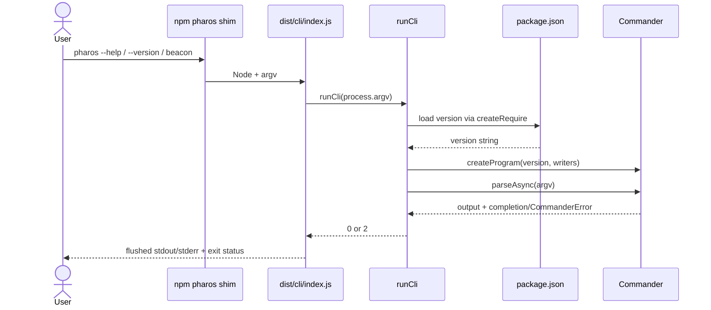

# Design: Runnable CLI

## Technical approach

Implement the first distribution boundary as a small Commander program under the existing `src/cli/` composition root. The executable module owns only process integration; a separate factory/runner module owns command construction and parse-result normalization. No application use case, adapter, product command, prompt, browser dependency, or persistence wiring is introduced.

The package remains a tsc-built, strict-ESM package. A clean explicit build produces `dist/cli/index.js`; npm maps the `pharos` bin to that file and packages the generated `dist/` tree plus the normal package documents. Packaging and installation never trigger a build or another lifecycle script.

## Architecture decisions

### 1. Separate the executable from the testable program

Use two production files:

- `src/cli/index.ts` is the executable. Its first bytes are exactly `#!/usr/bin/env node`. It passes `process.argv` to the runner, assigns `process.exitCode`, and handles only unexpected failures.
- `src/cli/program.ts` exports `createProgram`, `runCli`, and the package-version loader. It contains the Commander configuration and accepts injected output writers for deterministic tests.

`index.ts` does not export a reusable program and importing `program.ts` does not parse arguments. Internal ESM imports use emitted `.js` specifiers, for example `./program.js`, as required by the current `NodeNext` configuration.

This is the smallest separation that avoids process termination and argument parsing during source tests while preserving `src/cli/` as the composition boundary from the approved technical design.

Rejected alternatives:

- A single side-effecting `index.ts`: importing it in Vitest would parse the test process arguments and could terminate the worker.
- A larger command registry/composition framework: there are no product commands or dependencies to compose yet.
- A fake or wildcard Commander subcommand: it would make the command catalogue misleading. Unsupported input is handled as a root operand and no command is registered.

### 2. Read the version from the installed package manifest

`program.ts` loads `../../package.json` using `createRequire(import.meta.url)` from `node:module`, narrows the loaded value, and requires a non-empty string `version`. The factory accepts an optional injected version for isolated tests; normal execution always calls the loader.

The same relative URL works in all required layouts:

- source: `src/cli/program.ts` to repository `package.json`;
- build: `dist/cli/program.js` to repository `package.json`;
- installed archive: `node_modules/pharos/dist/cli/program.js` to installed `package.json`.

The package manifest is always present in an npm archive, and this design also lists it as part of the asserted archive contract. Failure to read valid metadata is an internal error, not a fabricated fallback version.

`createRequire` is intentionally used instead of a JSON ESM import. The latter would require `resolveJsonModule` and import-attribute handling whose support changed during the Node 20 line; it would expand compiler configuration for no product value. Reading with `node:fs` and manually parsing JSON is also unnecessary. A TypeScript version constant, generated source file, environment variable, or bundler replacement is rejected because each creates a second release authority or adds a build step.

### 3. Commander configuration and exit contract

`createProgram` creates a fresh `Command` on every call with:

- name `pharos`;
- a short description such as `Pharos command-line interface (bootstrap surface).`;
- version supplied from package metadata;
- conventional `-h, --help` and `-V, --version` options;
- no registered subcommands;
- explicit usage text `pharos [options]`;
- an optional internal root operand used only to turn `pharos beacon` into `unknown command 'beacon'`; the operand has no help description and the explicit usage string prevents it from being advertised;
- `exitOverride()` so Commander reports completion/errors to the runner rather than calling `process.exit`;
- injected `writeOut`/`writeErr` functions, defaulting to process stdout/stderr.

With no arguments, the root action prints the same help text and succeeds. If the internal unsupported operand is present, the action calls `program.error` with Commander error code `commander.unknownCommand` and exit code 2. Commander-detected invalid options or excess arguments are also normalized by `runCli` to usage exit code 2.

`runCli` calls `parseAsync` so later asynchronous actions can be added without changing the executable contract. It catches only `CommanderError`:

| Condition | Stream | Exit status |
|---|---|---:|
| no arguments or `--help` | stdout | 0 |
| `--version` | stdout | 0 |
| unsupported operand/option or invalid invocation | stderr | 2 |
| unexpected metadata/programming/runtime failure | stderr | 10 |

Help and version are represented by Commander as intercepted errors with status 0 and are normalized back to success. `index.ts` catches errors not classified as `CommanderError`, emits one concise `pharos: internal error` line without a stack trace, and sets status 10. It never calls `process.exit`, allowing output streams to flush.

This applies the already approved CLI exit table only where this minimal slice has outcomes: success, usage, and internal failure. Failure/refusal/inconclusive/interrupted product outcomes remain unimplemented.

### 4. Preserve the shebang through tsc and npm installation

The shebang is the first line of `src/cli/index.ts`, with no preceding comment or byte-order mark. TypeScript's current tsc emit preserves a leading hashbang in `dist/cli/index.js`; no bundler or post-processing step is added. Tests verify the emitted file starts with the exact bytes `#!/usr/bin/env node\n`.

The manifest maps `pharos` directly to `dist/cli/index.js`. During package installation npm creates the platform-specific executable shim and executable permissions from the `bin` declaration. No source-mode mutation, chmod script, `prepare`, or `postinstall` hook is needed.

### 5. Make the manifest distributable without widening the API

`package.json` changes are limited to the distribution boundary:

```json
{
  "name": "pharos",
  "version": "0.0.0",
  "license": "MIT",
  "type": "module",
  "engines": { "node": ">=20" },
  "bin": { "pharos": "dist/cli/index.js" },
  "files": ["dist/", "README.md", "LICENSE"],
  "dependencies": {
    "canonicalize": "2.1.0",
    "commander": "14.0.1"
  }
}
```

The existing `private: true` field is removed. The five existing scripts and their commands remain byte-for-byte unchanged; no sixth script and no npm lifecycle field is added. `main` and `exports` are omitted because this change defines an executable package, not a supported library API. Publishing configuration and release automation are also omitted.

`files` admits compiled output and normal package documents while excluding `src/`, `tests/`, `openspec/`, repository design documents, coverage, and tool configuration. npm includes `package.json` as mandatory archive metadata. The existing tsc declarations and source maps under `dist/` are considered part of compiled output; changing the established build shape is outside this change. `dist/` remains ignored and uncommitted.

### 6. Pin Commander as a runtime dependency

Add exactly `commander@14.0.1` with `npm install --save-exact commander@14.0.1`. Commander 14 matches the package's Node `>=20` floor and supplies the ESM-importable API used here. It belongs in `dependencies`, not `devDependencies`, because the installed executable imports it at runtime.

The generated lockfile v3 update must record the same exact root dependency and its integrity/resolution data. Do not hand-edit the lockfile and do not use a caret, tilde, tag, or floating major. Existing exact pins, including `canonicalize@2.1.0`, remain unchanged. `@clack/prompts` is not installed until an interactive workflow exists.

A broader semver range is rejected because a fresh consumer install of the tarball could otherwise run a Commander version not reviewed with this executable. A vendored parser or hand-written option parser is rejected because Commander is already the approved stack choice.

## Control and data flow



An unexpected non-Commander failure propagates from the runner to the entry, which writes the stable internal-error message and sets status 10.

## File changes

| File | Action | Responsibility |
|---|---|---|
| `src/cli/index.ts` | Replace placeholder | Shebang-bearing process entry and internal-error boundary |
| `src/cli/program.ts` | Add | Package-version loading, Commander factory, parse/exit normalization |
| `tests/cli/program.test.ts` | Add | In-process source behavior and command-catalogue tests |
| `tests/cli/distribution.test.ts` | Add | Clean build, emitted entry, pack, install, and executable tests |
| `package.json` | Modify | Publishable metadata, `bin`, `files`, exact Commander runtime dependency |
| `package-lock.json` | Regenerate | Locked root metadata and Commander artifact |
| `README.md` | Modify | Truthful bootstrap build/install/help/version examples and unavailable-product notice |

No other `src/` layer, toolchain config, npm script, OpenSpec baseline spec, or generated `dist/` file changes.

## Interfaces and contracts

The internal source seam is intentionally small:

```ts
interface CliWriters {
  readonly writeOut: (text: string) => void;
  readonly writeErr: (text: string) => void;
}

interface ProgramOptions extends Partial<CliWriters> {
  readonly version?: string;
}

function loadPackageVersion(): string;
function createProgram(options?: ProgramOptions): Command;
function runCli(argv: readonly string[], options?: ProgramOptions): Promise<number>;
```

`argv` uses the Node form (`[nodeExecutable, scriptPath, ...userArguments]`). Each call creates a new `Command`, so tests and future embedders do not share parser state. These exports are internal implementation seams only; the package declares no `exports` entry and makes no library compatibility promise.

User-visible contracts are:

- `pharos --version` writes exactly `<package.json version>\n` to stdout;
- `pharos --help` and no-argument invocation identify `pharos`, show options, and list no commands;
- `pharos beacon` writes an unknown-command usage error to stderr and exits 2;
- the installed npm bin resolves to `dist/cli/index.js` and executes under Node >=20.

## Testing strategy

### Source behavior (`tests/cli/program.test.ts`)

Use injected writers and call `runCli` directly; do not patch global stdout/stderr and do not spawn the source file.

1. Inject a sentinel version and assert `--version` returns 0 and writes only that version plus a newline.
2. Use the real metadata loader and assert its result equals the root manifest version, proving the release authority is not duplicated.
3. Assert `--help` and no arguments return 0, identify `pharos`, expose help/version options, contain no `Commands:` section, and contain none of the forbidden product vocabulary from the spec (case-insensitive).
4. Assert the returned program has zero registered commands.
5. Assert `beacon` returns 2, writes nothing to stdout, and reports `unknown command 'beacon'` on stderr.
6. Assert an unknown option and excess operands return 2 rather than Commander's default status.

Assertions use stable semantic fragments rather than snapshotting Commander's spacing, which can vary without changing the CLI contract.

### Built and packaged behavior (`tests/cli/distribution.test.ts`)

Run this suite sequentially and create all archives/consumer projects under one uniquely named OS temporary directory that is removed in `afterAll`. Child processes use `execFile` with argument arrays, never a shell command string.

1. Remove the ignored `dist/` directory and invoke the existing build explicitly. Verify `dist/cli/index.js` exists and starts with the exact shebang.
2. Execute `node dist/cli/index.js --help`, `--version`, and `beacon`; assert streams and statuses, including exact agreement with package metadata.
3. Read the source manifest and assert:
   - scripts are exactly `test`, `test:watch`, `build`, `lint`, `typecheck` with existing command values;
   - `private` and every lifecycle script are absent;
   - `type`, engine, license, `bin`, `files`, and exact runtime dependency are correct.
4. Run `npm pack --dry-run --json --ignore-scripts` after the build. Assert the reported file list contains `package.json`, `README.md`, `LICENSE`, and `dist/cli/index.js`; every entry must be either mandatory metadata/documentation or under `dist/`, and no source, test, OpenSpec, coverage, or tool-config path may appear.
5. Run the real `npm pack --json --ignore-scripts --pack-destination <temp>`, taking the generated filename from npm's JSON rather than predicting it.
6. Create a minimal private temporary consumer and install that tarball with `npm install --ignore-scripts --offline --no-audit --no-fund --package-lock=false <tarball>`. The preceding repository `npm ci` has already populated npm's inherited cache with the exactly pinned Commander artifact; offline mode prevents a passing test from depending on later registry state.
7. Assert the installed manifest still maps `pharos` to the packaged target, the target starts with the shebang, and the platform-appropriate `node_modules/.bin/pharos` shim exists. Invoke the shim for `--help` and `--version` and assert success and exact installed-manifest version output.

The explicit build is deliberately part of the test arrangement. `npm pack` and install run with scripts disabled, proving the artifact is complete before packaging and that installability does not depend on `prepare`, `prepack`, `postinstall`, or any other hook.

### Repository verification

The normal final gate remains:

```text
npm ci
npm test
npm run build
npm run lint
npm run typecheck
```

The packaging suite may leave a fresh ignored `dist/` tree during the test run; it must never be committed.

## Documentation approach

Update only the README status/development sections necessary to state:

- the bootstrap `pharos` executable now exists;
- maintainers run `npm ci` and `npm run build` before local packing/installing;
- `pharos --help` and `pharos --version` are the complete available surface;
- no product workflow or subcommand is available yet.

Do not reproduce the future command catalogue from the technical design and do not imply Beacon, browser, storage, or guided-flow functionality has landed.

## Risks and mitigations

| Risk | Mitigation |
|---|---|
| tsc drops or moves the shebang | Exact emitted-byte assertion plus direct built and installed-shim execution |
| Source version loading works but installed layout differs | One relative loader path is exercised in source, `dist/`, packed, and installed layouts |
| Commander terminates Vitest or returns its default status 1 | `exitOverride`, injected writers, and centralized 0/2 normalization |
| Hidden unsupported-input handling leaks into help | Explicit usage text, no argument description, zero-command assertion, and help-content test |
| Tarball omits the bin or includes repository internals | Explicit `files` allowlist and dry-run JSON path assertions before installation |
| Install silently relies on lifecycle hooks | Exact five-script assertion and `--ignore-scripts` on both pack and install |
| Consumer install drifts with registry state | Exact Commander pin, committed lockfile, and offline install test using the cache populated by `npm ci` |
| Removing `private` permits accidental publication | No publish command or release automation is added; scope is limited to local build/pack/install verification |
| Test volume approaches the 400-line review budget | Keep output checks semantic and share subprocess/temp helpers inside the distribution test; current estimate is approximately 330–380 authored changed lines excluding the generated lockfile and SDD artifacts. Tasks should split only if the refined forecast exceeds 400. |

## Rollout and rollback

Rollout is repository-local only:

1. Commit source, tests, manifest, lockfile, and README changes without `dist/`.
2. Verify from `npm ci` through all five canonical quality commands.
3. Perform the clean dry-run pack and temporary offline installation checks.
4. Do not publish a package or add release automation in this change.

Rollback before publication is a normal revert: restore `src/cli/index.ts` to its placeholder, remove `src/cli/program.ts` and CLI tests, restore `private: true`, remove `bin`/`files` and Commander, regenerate the lockfile, and revert README claims. Ignored local `dist/` and temporary test directories may be deleted without data migration.

If an archive has been published externally despite the rollout boundary, npm versions are immutable: deprecate the affected version and publish a corrected new version rather than attempting replacement. No domain state, persisted Beacon data, schema, or application migration is involved.

## Scope guard

This design adds only root help, root version, no-argument help, and unsupported-invocation handling. It does not add product subcommands, JSON envelopes, prompts, application composition, adapters, Playwright, Chromium installation, schema validation, storage, release publication, or lifecycle scripts.
